# Color gradients

In computer graphics, a [color gradient](https://en.wikipedia.org/wiki/Color_gradient) (sometimes called a _color ramp_ or _color progression_) specifies a range of position-dependent colors, usually used to fill a region. The colors produced by a gradient vary continuously with position, producing smooth color transitions.

Graphics32 supports many different types of color gradients such as linear, radial, conical, diamond, X, XY, and Squared(XY) to name a few.

::: center
<div style="display: flex; gap: 10px; align-items: center;">
  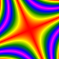
  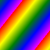
  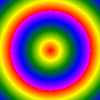
  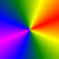
  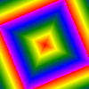
</div>
<!--     -->
:::

When defining the gradient color transitions there are hardly any limitations in the number of color stops or interpolation steps possible. Furthermore, for all gradients different [wrap modes](#wrap_modes) have been implemented (where possible). Finally some sparse point color interpolators have been implemented that can be used for simple mesh gradients.

## Simple 2-Point Linear Gradients

Classic color gradients only use 2 colors, with a linear transition from one color to the other color, as can be seen in Figure 1.

:::: thumbnail
::: center
<div style="display: flex; gap: 10px; align-items: center;">
  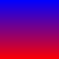
  
  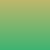
  
</div>
<!--   -->
:::
::: caption
**Figure 1:** Simple 2-point linear gradients
:::
::::

The code that built the above gradients is very simple; A *linear* gradient sampler is created and the values for each pixel is calculated:

```pascal:line-numbers
var
  X, Y: Integer;
  Sampler: TLinearGradientSampler;
begin
  Bitmap.SetSize(100, 100);
  
  Sampler := TLinearGradientSampler.Create;
  try
 
    Sampler.SimpleGradient(FloatPoint(0, 0), clBlue32, FloatPoint(0, 100), clRed32);
 
    Sampler.PrepareSampling;
 
    for Y := 0 to Bitmap.Width - 1 do
      for X := 0 to Bitmap.Height - 1 do
        Bitmap.Pixel[X, Y] := Sampler.GetSampleInt(X, Y);
 
  finally
    Sampler.Free;
  end;
end;
```

## Simple 2-Point Radial Gradients

Another classic color gradient supported by Graphics32 is the *circular gradient*. A circular gradient is specified as a circle that has one color at its circumference and another at its focus (the center, for a perfect circle). Colors are calculated by linear interpolation based on distance from the focus. The distance from the focus is mapped using a radius property.

:::: thumbnail
::: center
<div style="display: flex; gap: 10px; align-items: center;">
  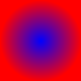
  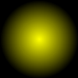
  
  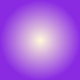
</div>
<!--   -->
:::
::: caption
**Figure 2:** Simple 2-point circular gradients
:::
::::

The code that built these gradients is also very simple; A _radial_ gradient sampler is created and the values for each pixel is calculated:

```pascal:line-numbers
var
  X, Y: Integer;
  Sampler: TRadialGradientSampler;
begin
  Bitmap.SetSize(100, 100);
  
  Sampler := TRadialGradientSampler.Create;
  try
 
    Sampler.Center := FloatPoint(Bitmap.Width div 2, Bitmap.Height div 2);
    Sampler.Radius := Bitmap.Width div 2;
    Sampler.Gradient.StartColor := clBlue32;
    Sampler.Gradient.EndColor := clRed32;
 
    Sampler.PrepareSampling;
 
    for Y := 0 to Bitmap.Width - 1 do
      for X := 0 to Bitmap.Height - 1 do
        Bitmap.Pixel[X, Y] := Sampler.GetSampleInt(X, Y);
 
  finally
    Sampler.Free;
  end;
end;
```

## Wrap Modes

As can be seen in Figure 2, the color outside the defined sample radius is clamped. While this might be desired and sufficient for typical cases, it is also possible to use other wrap modes. Figure 3 shows the red/blue radial gradient with the **Clamp**, **Repeat**, and **Mirror** wrap modes:

:::: thumbnail
::: center
| Clamp | Repeat | Mirror |
| --- | --- | --- |
|  | 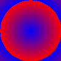 | 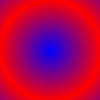 |
:::
::: caption
**Figure 3:** Different wrap modes: Clamp, Repeat, Mirror
:::
::::


Note that the repeat wrap mode may cause rough and pixelized edges rather than smooth transitions when the color starts to repeat. This can be corrected either by using a super-sampling gradient sampler (if a sampler is used as opposed to a polygon filler) or by adding further color stops:

:::: thumbnail
::: center
| Normal | Super-sampled | 3-point gradient |
| --- | --- | --- |
|  | 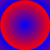 | 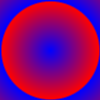 |
:::
::: caption
**Figure 4:** Fixing rough edges caused by wrap mode=repeat.
:::
::::

In addition to the above 3 wrap modes, there also a **Reflect** wrap mode that should be mentioned for completeness. Reflect is almost identical to the Mirror wrap mode. The difference lies on how the two behave at the point where they wrap. The four gradients below illustrate the difference between Clamp, Repeat, Mirror, and Reflect. Can you spot the difference between Mirror and Reflect?
::: center
<div style="display: flex; gap: 10px; align-items: center;">
  
  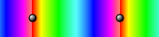
  
  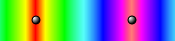
</div>
:::

Impossible. What if we stack them on top of each other then?

::: center
   
:::

No, right? But if we reduce the number of interpolation steps from 512 to just 16?

::: center
   
:::

And if we plot the sample function as a color ramp, the difference between the Mirror and Reflect modes becomes unmistakable:
::: center
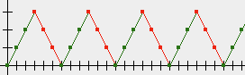 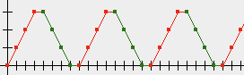
:::

In summary, the difference between Mirror and Reflect only really manifests itself with few color steps or if the gradient wraps many times.


## More than 2 colors

As was mentioned previously, there are hardly any limitations in the number of color stops that can be used in a gradient.

The class responsible for managing color stops is `TColor32Gradient`. When defining a gradient, color stops can either be added one at a time with the `AddColorStop` method - or the whole gradient can be defined directly with a dynamic array of color stops, using the `SetColors` method.