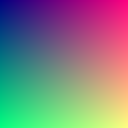
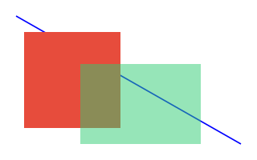
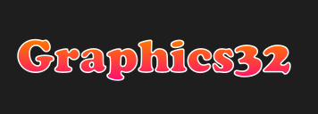
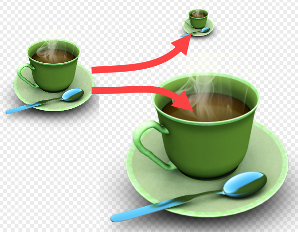
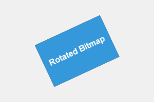
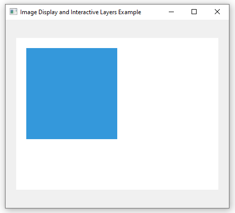
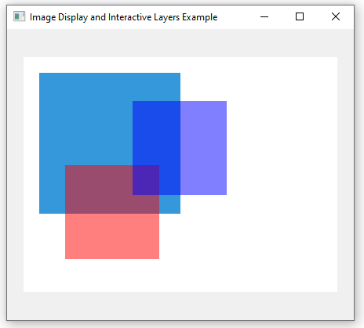
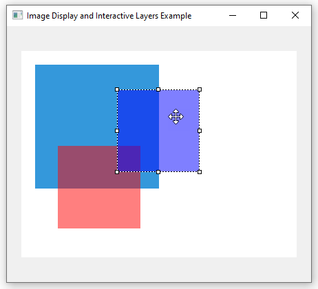
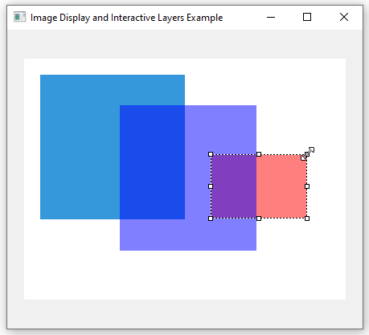

# Getting Started with Graphics32

Welcome to Graphics32! Whether you are building real-time image processing tools, custom UI widgets, data visualizers, or high-performance 2D games in Delphi or Lazarus (Free Pascal), Graphics32 gives you the speed, quality, and control needed for modern graphics applications.

---

## What is Graphics32?

Graphics32 is an open-source, high-performance 2D graphics library designed specifically for **Delphi** and **Lazarus / Free Pascal (FPC)**.

While standard framework controls (like VCL `TBitmap` and `TCanvas`) rely on platform OS APIs (such as Windows GDI), Graphics32 works directly with **32-bit Device Independent Bitmaps (DIBs)** in memory. By implementing hand-optimized SIMD assembler routines (SSE2, SSE4.1, etc.) and custom algorithms, Graphics32 provides pixel manipulation speeds up to **100 times faster** than native framework canvas operations.

### Key Highlights
- **32-Bit ARGB Color Model**: Full 8-bit per-channel precision for Red, Green, Blue, and Alpha transparency.
- **Sub-Pixel Precision & Anti-Aliasing**: Smooth line drawing and vector path rendering without jagged edges.
- **Vector Path & Text Engine**: Advanced vector rasterizer (`TCanvas32`) supporting gradients, complex paths, and outlined text.
- **High-Quality Resampling & Transforms**: Flexible resampler filters (Bilinear, Lanczos, Cubic) and affine transformations (rotation, scaling, skewing).
- **Interactive Layer Management**: Multi-layer bitmap composition with interactive position, scale, and alpha properties (`TImage32` + `TBitmapLayer`).
- **Cross-Platform**: Support for Windows (32-bit & 64-bit), Linux, and macOS.

**See also:** [Features](features)

---

## 1. Creating and Managing Bitmaps (`TBitmap32`)

The core object in Graphics32 is `TBitmap32`. Unlike `TBitmap` of the standard framework, `TBitmap32` is optimized to exclusively use a 32-bit ARGB pixel layout (`TColor32`/`TColor32Entry`).

### Basic Initialization and Color Creation

:::: right
::: tip
All the source code in this tutorial is available as read-to-run projects in the Graphics32 [`Examples\Getting Started`](https://github.com/graphics32/graphics32/tree/documentation/Examples/Getting%20Started) folder.

We suggest that, for each tutorial section, you start by reading the text and then experiment with the code afterwards.
:::
::::

Before you can do anything with a bitmap, you need to specify the bitmap size in pixels. This can either be done by setting the bitmap `Width` and `Height` properties individually, or it can be done with the `SetSize` method which sets them both in one go. By default `SetSize` will clear the bitmap to 100% transparent black, but this can be avoided (for better performance) if you are going to clear the bitmap to another color yourself anyway.

Colors in Graphics32 are represented by the standard `TColor32` type (a 32-bit unsigned integer usually formatted as `$AARRGGBB`). You can construct colors using the helper function `Color32(R, G, B, A)`, you can use the built-in constants like `clRed32`, `clBlue32`, and `clWhite32`, or you can simple specify the numeric value of the color. The latter is most easily done in hex notation: `$FFFF0000` 🔴, `$FF0000FF` 🔵, `$FFFFFFFF` ⚪, etc.

```pascal
uses
  GR32;

procedure CreateAndClearBitmap;
var
  Bitmap: TBitmap32;
begin
  Bitmap := TBitmap32.Create;
  try
    // Set the width and height of the bitmap.
    // Do not waste time clearing the bitmap since we do that below.
    Bitmap.SetSize(400, 300, False);

    // Clear the entire canvas with a semi-transparent blue-ish background
    // Color32 parameters: Red, Green, Blue, Alpha (0 = transparent, 255 = opaque)
    Bitmap.Clear(Color32(41, 128, 185, 127));

    // Save the result to a BMP file...
    Bitmap.SaveToFile('getting-started-bitmap.bmp');
    // ...and also save to a PNG file while we're at it
    Bitmap.SaveToFile('getting-started-bitmap.png');
  finally
    Bitmap.Free;
  end;
end;
```
::: box-blue
[Example source code](https://github.com/graphics32/graphics32/tree/documentation/Examples/Getting%20Started/1.%20Creating%20and%20Managing%20Bitmaps)
:::

:::: thumbnail
::: center

:::
::: caption
A bitmap - Yawn!
:::
::::

**See also:**
- [[TBitmap32]]
- [[TBitmap32.SetSize]]
- [[TBitmap32.Clear]]
- [[TBitmap32.SaveToFile]]
- [[TColor32]]
- [[TColor32Entry]]
- [[Colors]]
- [[Color32]]

---

## 2. Direct Pixel Access (`Pixel[]` & `PixelS[]`)

One of Graphics32's greatest strengths is direct array access to pixel memory.

You can read or write any pixel on the bitmap using the default `Pixel[X, Y]` property. If you need safety against out-of-bounds coordinates (such as during image processing loops), use `PixelS[X, Y]` which automatically performs clipping.

```pascal
uses
  GR32;

procedure CreateCustomGradient(Bitmap: TBitmap32);
var
  X, Y: Integer;
  R, G, B: Byte;
begin
  Bitmap.SetSize(256, 256, False);

  // Directly set each pixel color based on coordinates
  for Y := 0 to Bitmap.Height - 1 do
  begin
    for X := 0 to Bitmap.Width - 1 do
    begin
      R := Byte(X);
      G := Byte(Y);
      B := 128;
      // Pixel[] offers raw, high-speed per-pixel access
      Bitmap.Pixel[X, Y] := Color32(R, G, B, 255);
    end;
  end;
end;
```
::: box-blue
[Example source code](https://github.com/graphics32/graphics32/tree/documentation/Examples/Getting%20Started/2.%20Direct%20Pixel%20Access)
:::

:::: thumbnail
::: center

:::
::: caption
Direct Pixel Access Gradient
:::
::::

**See also:**
- [[TBitmap32.Pixel]]

---

## 3. Drawing Shapes & Alpha Blending

Graphics32 supports drawing primitives like lines, rectangles, and ellipses directly onto `TBitmap32`.

To fill rectangles with alpha transparency, use `FillRectT` (or `FillRectTS` for bounds-checked clipping). For anti-aliased lines, use `Bitmap.LineA`.

```pascal
uses
  GR32;

procedure DrawBlendedShapes(Bitmap: TBitmap32);
begin
  Bitmap.SetSize(320, 200, False);
  Bitmap.Clear(clWhite32);

  // Draw an anti-aliased diagonal blue line
  Bitmap.LineA(20, 20, 300, 180, clBlue32);

  // Fill a solid red-ish rectangle (opaque)
  Bitmap.FillRect(30, 40, 150, 160, Color32(231, 76, 60, 255));

  // Fill an overlapping semi-transparent green-ish rectangle (50% opacity) using FillRectT
  Bitmap.FillRectT(100, 80, 250, 180, Color32(46, 204, 113, 128));
end;
```
::: box-blue
[Example source code](https://github.com/graphics32/graphics32/tree/documentation/Examples/Getting%20Started/3.%20Drawing%20Shapes%20and%20Alpha%20Blending)
:::

:::: thumbnail
::: center

:::
::: caption
Shapes with Transparency and Alpha Blending
:::
::::

**See also:**
- [Alpha Composition (alpha blending)](alpha-composition)
- [Naming conventions, Line and Pixel methods](naming-conventions#line-and-pixel-methods)
- [[TBitmap32.DrawMode]]
- [[TBitmap32.LineA]]
- [[TBitmap32.FillRect]]

---

## 4. Vector Graphics & Text with `TCanvas32`

For advanced vector rendering, such as antialiased text, custom path outlines, and smooth color gradients, you can use `TCanvas32` from the `GR32_Paths` unit.

`TCanvas32` coordinates vector paths and applies brushes from its `Brushes` collection (such as `TSolidBrush` and `TStrokeBrush`) to fill or stroke vector paths and rendered text onto the target `TBitmap32`.

### Example: Outlined Text filled with a Color Gradient

```pascal
uses
  GR32, GR32_Paths, GR32_Brushes, GR32_ColorGradients, GR32_Polygons;

procedure DrawGradientText(Bitmap: TBitmap32);
var
  Canvas: TCanvas32;
  FillBrush: TSolidBrush;
  StrokeBrush: TStrokeBrush;
  Filler: TLinearGradientPolygonFiller;
begin
  Bitmap.SetSize(400, 150, False);
  Bitmap.Clear(Color32(30, 30, 30));

  // Configure font settings on the target bitmap
  Bitmap.Font.Name := 'Cooper Black';
  Bitmap.Font.Size := 40;

  Canvas := TCanvas32.Create(Bitmap);
  try
    // 1. Configure solid fill brush with a linear gradient filler
    //    This is just one way of adding a brush; Through the Brushes.Add method.
    FillBrush := TSolidBrush(Canvas.Brushes.Add(TSolidBrush));
    FillBrush.FillMode := pfNonZero;

    Filler := TLinearGradientPolygonFiller.Create;
    try
      Filler.SimpleGradient(FloatPoint(0, 45), Color32(255, 120, 0),
                            FloatPoint(0, 95), Color32(255, 0, 128));
      FillBrush.Filler := Filler;

      // 2. Configure stroke brush for white outline
      //    This another way of adding a brush; Through the brush constructor.
      StrokeBrush := TStrokeBrush.Create(Canvas.Brushes);
      StrokeBrush.FillColor := clWhite32;
      StrokeBrush.StrokeWidth := 1.5;

      // Render vector text using both brushes on TCanvas32
      Canvas.RenderText(20, 45, 'Graphics32');
    finally
      Filler.Free;
    end;
  finally
    Canvas.Free;
  end;
end;
```
::: box-blue
[Example source code](https://github.com/graphics32/graphics32/tree/documentation/Examples/Getting%20Started/4.%20Vector%20Graphics%20and%20Text%20with%20TCanvas32)
:::

:::: thumbnail
::: center

:::
::: caption
Vector Text with Stroke and Gradient Fill
:::
::::

**See also:**
- [Color gradients](color-gradients)
- [[TCanvas32]]
- [[TCanvas32.RenderText]]
- [[TStrokeBrush]]
- [[TLinearGradientPolygonFiller]]

---

## 5. Resampling & Bitmap Rotation

Graphics32 makes it easy to scale and rotate images with crisp sub-pixel interpolation.

### High-Quality Bitmap Resampling (Scaling)

When resizing bitmaps, you can assign high-quality resamplers (such as `TLinearResampler` or `TKernelResampler`) to control interpolation quality.

```pascal
uses
  GR32, GR32_Resamplers;

procedure ScaleImageHighQuality(Source, Target: TBitmap32; NewWidth, NewHeight: Integer);
begin
  Target.SetSize(NewWidth, NewHeight);

  // Instantiating TLinearResampler automatically assigns it to Source.Resampler
  TLinearResampler.Create(Source);

  // Stretch-draw source onto target with smooth bilinear filtering
  Source.DrawTo(Target, Target.BoundsRect);
end;
```

:::: thumbnail
::: center

:::
::: caption
Bitmap Resampling
:::
::::

::: info
Note that when we create a resampler, and specify a bitmap as the owner, ownership of the resampler is automatically transferred to the bitmap and its previous resampler is freed.
:::

**See also:**
- [Sampling and Rasterization](sampling-and-rasterization)
- [[TLinearResampler]]
- [[TKernelResampler]]
- [[TBitmap32.DrawTo]]

### Rotating a Bitmap with `TAffineTransformation`

The `TAffineTransformation` class (located in `GR32_Transforms`) lets you rotate, scale, and translate bitmaps arbitrarily around any center point. Use the standalone `Transform` routine from `GR32_Transforms` to transform the `Source` bitmap into the `Target` bitmap.

```pascal
uses
  Math, GR32, GR32_Transforms, GR32_Resamplers;

procedure RotateBitmap(Source, Target: TBitmap32; AngleDegrees: Single);
var
  Transform: TAffineTransformation;
  r: TFloatRect;
begin
  Transform := TAffineTransformation.Create;
  try
    // Set original source rectangle bounding box
    Transform.SrcRect := FloatRect(Source.BoundsRect);

    // Translate origin to center, rotate by angle, and translate back.
    // In other words: Rotate around center point (X, Y) by specified angle in degrees
    Transform.Rotate(Source.Width / 2, Source.Height / 2, AngleDegrees);

    // Get the size the bitmap will have once it's been rotated
    r := Transform.GetTransformedBounds(FloatRect(Source.BoundsRect));

    // Center the rotated result in the target bitmap (which will be larger
    // than the source because of the rotation)
    Transform.Translate((r.Width - Source.Width) / 2, (r.Height - Source.Height) / 2);

    // Size the target so it fits the rotated bitmap
    Target.SetSize(Ceil(r.Width), Ceil(r.Height));

    // Apply the transformation
    GR32_Transforms.Transform(Target, Source, Transform);
  finally
    Transform.Free;
  end;
end;
```
::: box-blue
[Example source code](https://github.com/graphics32/graphics32/tree/documentation/Examples/Getting%20Started/5.%20Resampling%20and%20Bitmap%20Rotation)
:::

:::: thumbnail
::: center

:::
::: caption
Bitmap Rotation
:::
::::

**See also:**
- [[TAffineTransformation]]
- [[TAffineTransformation.Rotate]]
- [[TAffineTransformation.GetTransformedBounds]]
- [[TAffineTransformation.Translate]]
- [[Transform]]

---

## 6. Image Display & Interactive Layers with `TImage32`

To display bitmaps in your Delphi or Lazarus forms with flicker-free rendering, Graphics32 provides the `TImage32` component.

### Basic Image Display

Drop a `TImage32` onto your form and perform your drawing directly on its `Bitmap` buffer:

```pascal
implemtation

uses
  GR32, GR32_Image, GR32_Layers;
...
```

```pascal
procedure TForm1.FormCreate(Sender: TObject);
begin
  // Size background bitmap and clear to opaque white
  Image321.Bitmap.SetSize(400, 300, False);
  Image321.Bitmap.Clear(clWhite32);

  // Draw blue-ish opaque box onto background bitmap
  Image321.Bitmap.FillRect(20, 20, 200, 200, Color32(52, 152, 219));
end;
```
:::: thumbnail
::: center

:::
::: caption
Form with TImage32
:::
::::

### Using Image Layers (`TBitmapLayer`)

`TImage32` has built-in support for interactive overlay layers. A `TBitmapLayer` contains its own bitmap buffer and can be positioned, scaled, made semi-transparent, and dragged independently over the background image.

::: tip Note on Layer bitmap ownership
When you create a `TBitmapLayer.Create(Image32.Layers)`, the layer automatically manages and frees its internal `Bitmap` instance. You do **not** need to manually instantiate or free `Layer.Bitmap`.
:::

First let's create a function that sets up a bitmap layer, fills it with some color and places it at a random position:

```pascal
function TForm1.AddOverlayLayer(AImageControl: TImage32; AColor: TColor32): TPositionedLayer;
var
  Layer: TBitmapLayer;
  r: TFloatRect;
begin
  // Create a new bitmap layer owned by ImageControl.Layers
  Layer := TBitmapLayer.Create(AImageControl.Layers);

  // Configure layer/bitmap size and color
  Layer.Bitmap.SetSize(120, 120, False);
  Layer.Bitmap.Clear(AColor);

  // Setup bitmap blending so the transparency works
  Layer.Bitmap.DrawMode := dmBlend;
  Layer.Bitmap.CombineMode := cmMerge;

  // Make layer position relative to image bitmap and follow its scale
  Layer.Scaled := True;

  // Position layer at a random position within the image control
  r.Left := Random(AImageControl.Width - Layer.Bitmap.Width);
  r.Top := Random(AImageControl.Height - Layer.Bitmap.Height);
  r.Right := r.Left + Layer.Bitmap.Width;
  r.Bottom := r.Top + Layer.Bitmap.Height;
  Layer.Location := r;

  Result := Layer;
end;
```

...and then update our `FormCreate` to create a couple of layers:

```pascal
procedure TForm1.FormCreate(Sender: TObject);
var
  Layer1: TPositionedLayer;
  Layer2: TPositionedLayer;
begin
  // Size background bitmap and clear to opaque white
  Image321.Bitmap.SetSize(400, 300, False);
  Image321.Bitmap.Clear(clWhite32);

  // Draw blue-ish opaque box onto background bitmap
  Image321.Bitmap.FillRect(20, 20, 200, 200, Color32(52, 152, 219));

  // Add two bitmap layers
  Layer1 := AddOverlayLayer(Image321, clTrRed32); // Semi-transparent red
  Layer2 := AddOverlayLayer(Image321, clTrBlue32); // Semi-transparent blue
end;
```
:::: thumbnail
::: center

:::
::: caption
TImage32 with layers
:::
::::

### Interactive Layers (`TRubberbandLayer`)

If we want to control the size and position of the layers, we can add a `TRubberbandLayer` and attach it to the layer we want to manipulate.

Update the form declaration to hold a reference to our rubberband layer:

```pascal
type
  TForm1 = class(TForm)
    ...
  private
    FRubberbandLayer: TRubberbandLayer;
  end;
```

...and update `FormCreate` again to create the new layer:

```pascal
procedure TForm1.FormCreate(Sender: TObject);
...
begin
  ...same as before...

  // Add interactive rubberband layer...
  FRubberbandLayer := TRubberbandLayer.Create(Image321.Layers);
  // ...and attach it to the first layer
  FRubberbandLayer.ChildLayer := Layer1;
end;
```

:::: thumbnail
::: center

:::
::: caption
Image Control with rubberband layer
:::
::::

Notice that we can now move and resize the bitmap layer attached to the rubberband layer. Pretty neat, huh?

But what about the other bitmap layer? Well, in theory we could just create yet another rubberband layer but instead we reuse the one we already have and switch the layer it attaches to when we click on another layer. In order to do so, we create a `TImage32.OnMouseDown` event handler:

```pascal
procedure TForm1.Image321MouseDown(Sender: TObject; Button: TMouseButton; Shift: TShiftState;
  X, Y: Integer; Layer: TCustomLayer);
begin
  // Only react to left-click
  if (Button <> mbLeft) then
    exit;

  // Did we click on a layer - and is it one that can be moved?
  if (Layer <> nil) and (Layer is TPositionedLayer) then
  begin
    // Attach the rubberband to the layer we just clicked on (unless it's
    // the rubberband itself)
    if (Layer <> FRubberbandLayer) then
    begin
      FRubberbandLayer.ChildLayer := TPositionedLayer(Layer);
      FRubberbandLayer.Visible := True;
    end;
  end else
  begin
    // Detach and hide the rubberband when we click outside a layer
    FRubberbandLayer.ChildLayer := nil;
    FRubberbandLayer.Visible := False;
  end;
end;
```

And presto! We can now move and resize both layers.

::: box-blue
[Example source code](https://github.com/graphics32/graphics32/tree/documentation/Examples/Getting%20Started/6.%20Image%20Display%20and%20Interactive%20Layers%20with%20TImage32)
:::

:::: thumbnail
::: center

:::
::: caption
More cow bell!
:::
::::

---

## Next Steps

Now that you have a grasp of the fundamentals, explore the rest of the documentation to dive deeper into Graphics32's capabilities:

- **[Installation Guide](/guide/installation)**: Learn how to set up Graphics32 packages in RAD Studio / Delphi and Lazarus.
- **[Drawing & Blending](/guide/drawing-and-blending)**: Discover pixel blend modes, custom combine functions, and rasterization options.
- **[Color Gradients](/guide/color-gradients)**: Explore radial, linear, and multi-stop gradient samplers and wrap modes.
- **[Resampling & Transforms](/guide/resampling-and-transforms)**: Master high-quality resampling kernels and affine/projective transformations.
- **[API Reference](/api/)**: View full class reference documentation for all units, types, and methods.
