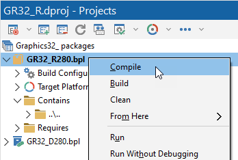
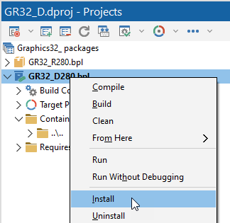
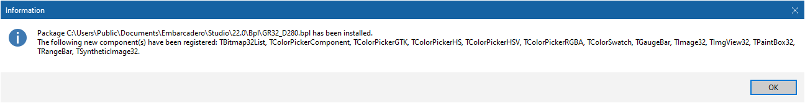
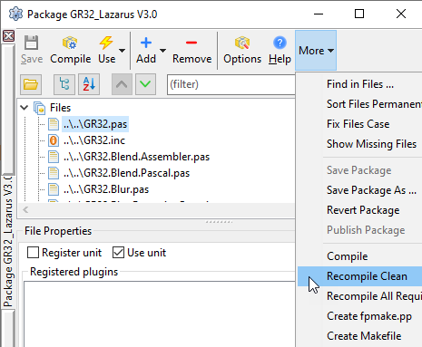
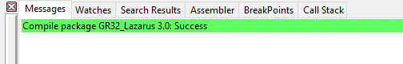
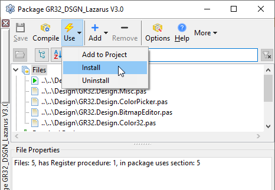

# Installation

## Get the source code

You can get the latest source code from the Graphics32 Git repository. Either using a Git client to clone the repository or by simply downloading a zip file with the latest snapshot.

  * Git: <https://github.com/graphics32/graphics32.git>
  * Zip file: <https://github.com/graphics32/graphics32/archive/refs/heads/master.zip>

Copy the source code to a location of your choice. In the installation procedures below we use the location `C:\Projects\Graphics32` as an example.

## Installation procedure for Delphi / C++ Builder / RAD Studio

Note: While the following procedure only mentions Delphi it applies to both Delphi and C++ Builder.

  1. Start Delphi.
  2. Add the location of the Graphics32 source to the global library search path.
You can skip this step if you prefer to use per-project library search paths for your own projects. All of Graphics32’s own packages and examples use per-project search paths so they don’t require the source to be in the global search path.
     1. From the menu select **Tools** →**Options…**
     2. Select **Language** →**Delphi** →**Library**.
     3. Select the **Library path** field and add the source folder location: `C:\Projects\Graphics32\Source`.
     4. Do the above for all the required platforms; Windows 32-bit, Windows 64-bit, etc.
  3. From the menu, select **File** →**Open project…**
  4. Navigate to the `Grapics32\Source\Packages` folder and from there open the package folder that corresponds to your version of Delphi.
Note that Delphi 11 and later versions all use the same package files.
  5. Open the `Graphics32_packages.groupproj` project group file.
The project group contains two projects:
     * The Graphics32 run-time package: `GR32_R`
     * The Graphics32 design-time package: `GR32_D`
  6. From the Delphi project manager, activate the Graphics32 run-time package and compile it.
     
  7. From the Delphi project manager, activate the Graphics32 design-time package and install it.
     
  8. You should now get a message box notifying you of the package installation and the components it contains:
     

## Installation procedure for Lazarus

The installation procedure for Lazarus is pretty horrible due to deficiencies in the FreePascal compiler or the Lazarus build system.

  1. Open the `GR32_Lazarus` run-time package. .
     Select **Recompile clean** from the **More** package toolbar menu.
     
  2. Compile `GR32_Lazarus` again.
     Repeat this 3-4 times until the compile completes without any messages.
     
  3. Open the `GR32_DSGN_Lazarus` design-time package.
     Select **Use** →**Install** from the package toolbar.
     

See also:

  * [Graphics32, issue 297: Lazarus design time support broken](https://github.com/graphics32/graphics32/issues/297#issuecomment-2050525983)
  * [FreePascal, issue 12223: Unit with inline, and recursive uses, needs recompilation right after compilation](https://gitlab.com/freepascal.org/fpc/source/-/issues/12223)
  * [FreePascal, issue 15221: Checksum issue](https://gitlab.com/freepascal.org/fpc/source/-/issues/15221)
  * [FreePascal, issue 19673: Problems with circular references and inline procedures.](https://gitlab.com/freepascal.org/fpc/source/-/issues/19673)
