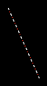

# Line patterns

Graphics32 defines several functions to support non-uniform lines. This includes gradient lines, dashed lines etc.

The concept is pretty simple: Each [[TBitmap32]] object contains a dynamic array of colors, and a color index which ‘crawls’ along the array. The line drawing algorithm samples colors from the color array, at the current color position. The color index is automatically incremented after each sample.

The color index, accessed through the [[TCustomBitmap32.StippleCounter|StippleCounter]] property, wraps itself automatically at the edges of the color array. It can move in both directions depending on the value of the [[TCustomBitmap32.StippleStep|StippleStep]] property, which in turn can be positive or negative. Its value may even be fractional in which case the resulting color is interpolated between two colors of the color array.

The [[TCustomBitmap32.AdvanceStippleCounter|AdvanceStippleCounter]] method advances `StippleCounter` by the value of `StippleStep`.

The [[TCustomBitmap32.GetStippleColor|GetStippleColor]] function returns the color at the current color index position and then, by default, advances the color index position by calling `AdvanceStippleCounter` so that the next `GetStippleColor` call will return a color value from the next position.

::: info Note
The stippled line drawing functions internally calls `GetStippleColor` and `AdvanceStippleCounter` for each pixel, so you do not need to do that manually.
:::

::: warning
`GetStippleColor` and `AdvanceStippleCounter` is not thread safe and the `StippleCounter` value is shared by all threads accessing the bitmap.
If you are drawing stippled lines, or manually calling `GetStippleColor` or `AdvanceStippleCounter`, on the same bitmap from multiple threads, then you need to synchronize the calls so only one thread is inside these functions at a time.
:::

::: info Note
Drawing functions that support line patterns have **P** in their [postfix](naming-conventions/) (for example, `LineFSP`).
:::

### Examples

#### Drawing a dashed line

The following code snippet draws a dashed line made up of alternating white dashes and red dots.

```pascal:line-numbers
// Set up the stipple pattern
Bitmap.SetStipple([clWhite32, clWhite32, clWhite32, 0, 0, clRed32, 0, 0]);
Bitmap.StippleStep := 1; // 1 pixel per color in pattern
 
// Draw a stippled line
Bitmap.LineFSP(10, 10, 50, 100);
```

::: center

:::

#### Drawing a gradient line

The following code snippet draws a gradient line. The gradient transitions smoothly from red to blue to yellow.

```pascal:line-numbers
// Set up the gradient pattern
Bitmap.SetStipple([clRed32, clBlue32, clYellow32]);
Bitmap.StippleStep := 0.1; // Smooth transition
 
// Draw a gradient line
Bitmap.LineFSP(10, 10, 50, 100);
```
::: center

:::
