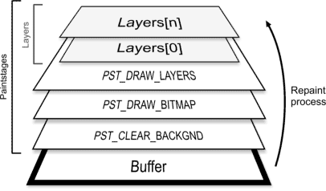
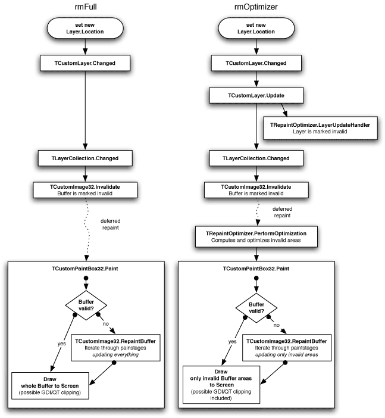
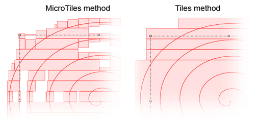
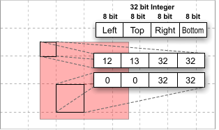
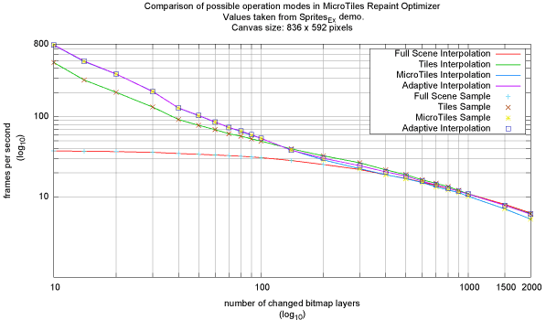
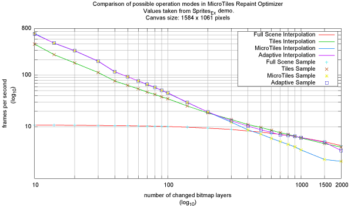

# Repaint optimization

## Introduction

Two basic controls for on screen display exist in Graphics32: [[TCustomPaintBox32]] and [[TCustomImage32]]. These two classes provide the functionality all other graphical controls in Graphics32 are based on.

::: info Note
While this article focuses on the [[TCustomPaintBox32]] and [[TCustomImage32]] base classes. The problems and solutions they outline extends to the derived controls that you would actually use, such as [[TPaintBox32]], [[TImage32]], and [[TImgView32]].
:::

### Double buffering in TCustomPaintBox32
`TCustomPaintBox32` implements a control similar to the `TPaintBox` control known from Delphi’s Visual Component Library (VCL). It differs from the latter in the way it handles repaints: While `TPaintBox` directly draws to the display context whenever it needs to update, `TCustomPaintBox32` uses an in-memory backbuffer. This technique, generally called [*double buffering*](https://en.wikipedia.org/wiki/Multiple_buffering#Double_buffering_in_computer_graphics), has its up and downsides: While it provides a convenient and simple way to avoid flickering by reducing many on-screen paint operations to just one synchronized buffer transfer (blit) from memory to screen, it also require a significant amount of memory and bus bandwidth which in turn effectively limits the number of possible updates per second depending on the hardware used. The main problem with a too simplistic approach to double buffering, is that the whole buffer is transferred to screen even if just a small fraction of its area has changed. Thus there is a lot of potential to improve on - more on this later.

### Repaints in TCustomImage32
The `TCustomImage32` control extends `TCustomPaintBox32` by replacing the direct painting to the back buffer with so called stacked [*Paint Stages*](./using-timage32/paint-stages). Upon repaint these paint stages are executed in a succesive fashion, from bottom to top – each stage drawing onto the result of the previous to produce the final output.


**Figure 1:** Paintstages at runtime

Once a change happens in this stack, at any given stage, a deferred invalidation of the whole back buffer content is triggered, which in turn leads to a complete repaint of all stages once this invalidation request is handled by the application message queue. This is where the main problem resides: Even with the smallest change (e.g. updating a single pixel in a layer) the whole buffer area needs to be repainted. This approach, though simple, is naive and results in unnecessary CPU and bus- and memory-bandwidth utilization.

---

To sum up, we have two main problems to overcome, i.e. to optimize away:

  * Forced full scene repaint of paint stages to back buffer in `TCustomImage32`.
  * Forced full scene repaint from back buffer to screen in `TCustomPaintBox32`.


## The Repaint Optimizer

In order to resolve the two problems outline above, `TCustomPaintBox32` and `TCustomImage32` employs an internal *repaint optimizer* object that takes care of the aspect of managing and optimizing changed areas.

To control how updates and repaint are handled, `TCustomPaintBox32` (and by inheritance `TCustomImage32`) provides the [[TCustomPaintBox32.RepaintMode|RepaintMode]] property.
`RepaintMode` controls what algorithm is used to manage repaints:

* **`rmFull`** means that no repaint optimization will be used; Every change, no matter how small, produces a full scene repaint.
* **`rmOptimizer`** means that the repaint manager is used to repaint only updated areas.


**Figure 2:** Comparison between full scene and optimized repaint

Figure 2 shows an example comparison of a `rmFull` full scene repaint and an `rmOptimizer` optimized repaint, for simple layer operations like moving or resizing. It can be seen that the `rmOptimizer` method breaks the full scene repaint down to just a fractional repaint - namely those parts that were changed. Both modes are used in `TCustomPaintBox32` for repaint to screen and in `TCustomImage32` for repaint to buffer.

::: info
 In addition to `rmFull` and `rmOptimizer`, there is an addition repaint mode named `rmDirect` which provides a method for direct repainting to screen.
 In this mode the deferred repaint technique is replaced by an immediate repaint. The use cases for this technique are very limited, but is especially useful for something like the [[TSyntheticImage]] class, which provides incremental painting of the result while still rendering.
 :::

## Measuring Mode

Layers in Graphics32 are a special case that needs to be taken care of separately; Since layers are not forced to stay within their determined bounds (for `TPositionedLayer` for example), they can basically paint everywhere on the buffer. Thus we need to find some other way of determining which areas the layer is drawing to. In order to enable this, all safe drawing operations in Graphics32 supports a mechanism called measuring. This method can basically be thought of as a simulation mode or dry-run where nothing is actually drawn to the buffer but the target bitmap is still notified of what *would* have been changed. So, this way the repaint optimizer can get information of which areas the operation is drawing to. As a matter of fact, the repaint optimizer just needs to iterate through all marked layers (compare _Figure 2_), calling the Paint method of each layer with the measuring mode enabled. The information gathered in this process is used for the repaint manager’s internal optimization work, ie. unifying overlapping areas and minimizing the number of rectangles to be updated.

Profiling has shown, that the measuring process adds only negligible overhead to the repaint process. However, the developer needs to take care of certain facts in his custom code in order to actually take advantage of the performance benefits the repaint optimizer offers.

::: half
**Code 1**
```pascal:line-numbers
begin
  MyDrawingOperation(Buffer);
  Buffer.Changed;
end;
```
:::
::: half
**Code 2**
```pascal:line-numbers
begin
  if not Buffer.Measuringmode then
    MyDrawingOperation(Buffer);
  Buffer.Changed(RectOfAreaThatWasChanged);
end;
```
:::

Code 1 compared to Code 2 illustrates the required changes in pseudo-Pascal-code. As seen in Code 2, a simple check for active measuring mode is introduced. In this case the actual drawing operation is omitted, but the change notification is still done.

If the developer’s code includes calls to the `Changed` method, those calls needs to be changed to only represent the *changed area* instead of the whole buffer area. Keeping the `Changed` method unmodified will force a complete buffer invalidation, thus the effect of the repaint optimizer and the partial repaint therefore is effectively annulled. Also, the custom code needs to be fully safe, meaning it has to offer full clipping support.

If the developer’s custom code solely relies on the safe drawing operations provided by Graphics32, there is no need to change this code since those functions already handle measuring mode internally. However, doing so will likely result in better performance especially if the custom code is calling many safe drawing operations. In this case introducing the changes of _Code 2_ could simplify the measuring process a lot by overriding all subordinated checks by one superordinate check for measuring mode.

So, to sum up, there are two possible pitfalls in custom code that can occur with the optimized repaint approach:

  1. `Changed` calls need to be taken care of (or else the whole buffer area is repainted).
  2. Custom code has to be clippable, ie. needs to obey the buffer’s `ClipRect` property (or else visual artifacts and failures appear).


## Internals

As already mentioned above, the repaint optimizer is responsible for managing and optimizing changed areas, which are described by rectangles. Because there can be quite a lot changes happening between repaints, the area information has to be saved in a space-saving and performance-optimal structure.

The naive approach of saving all rectangles into a list and combining them, once the repaint optimizer must determine what to repaint, is not suitable. With each `TRect` instance being 16 byte in size, the memory usage is unacceptable for large sets and the overhead of reallocating such structures is also noticeable. Moreover one has to make sure not to add several overlapping rectangles to the list as using an algorithm to handle this matter adds complexity to the process. Thus, a better and more flexible way of managing possibly overlapping rectangles must be used.

### Dirty rectangles

One approach to the "dirty rectangles" problem is to subdivide the buffer’s dimension into a matrix; Each cell or tile of this matrix is responsible for a 32x32 pixel area in the buffer. New rectangles are simply rendered to this matrix. The memory usage stays constant because the matrix size is in fixed relation to the bitmap buffer size. Also, the problem of handling overlapping rectangles is also easily solved by rendering to the matrix. Additionally, unifying tiles to bigger rectangles is obviously less complex than the approach needed for determining and unifying rectangles from a list structure. However, because each tile of our matrix only holds a binary value (filled or empty), the granularity (compare Figure 3) of this approach is quite high and thus too much information is lost.


**Figure 3:** Granularity comparison of MicroTiles and Tiles

### Micro Tiles

The solution used by the Graphics32 repaint optimizer is based on the tile method but resolves the granularity problem by expanding each tile in the matrix from a binary representation to an integer representation.


**Figure 4:** Rectangle rendered to 32 x 32 Pixel MicroTiles

So, instead of only having to restrict to *full* or *empty* as possible values, the tile contains exactly one rectangle that can further define the content. The two 16-bit values in the 32-bit integer of each tile represent the upper left and lower right corner of the inscribed rectangle relative to the upper left position of the tile (Figure 4). This allows a finer granularity and in the worst case (tile completely filled with one inscribed rectangle) the solution equals the tile based approach. However, most times the result is better, thus more information about the original shape is kept.

Because each coordinate is 8-bit wide, the tile size can scale up to 256 x 256 in size.

This method was first implemented by the developer of [libart](http://www.levien.com/libart/) by the name [MicroTile Arrays](http://www.levien.com/libart/uta.html). Graphics32 implements an optimized version of its own and mixes that with some specialities: The MicroTiles Repaint Optimizer implements a simple adaptive algorithm that chooses between full scene, tile and MicroTile based operation mode depending on the current update situation.

For instance with many small rectangles (500+) the MicroTiles based optimization becomes less effective and can impose a performance penalty. In this case the adaptive algorithm will automatically downgrade to the next lower mode, which in that situation is the tiles based mode. Because the granularity is bigger in this mode, the optimization process is also less complex. Once the situation normalizes, it switches back to MicroTiles based operation mode. Thus, a good performance should be guaranteed in almost all cases.

## Benchmarks

The [[Sprites_Ex]] project was the most important performance test case of all because it is exceptional in the way that it shows both the strengths and weaknesses of the MicroTiles based approach. For our tests we’ve extended the project slightly to be able to measure the effective frames (or updates) per second.

 
**Figure 5:** Benchmark results with Sprites_Ex

Figure 5 shows two results of benchmarking with different canvas resolutions. Each bitmap layer has a size of either 32 x 32 or 64 x 64 pixel picked randomly. The random seed used in the benchmark is reproducible for each test machine, thus a valid comparison is possible.

As seen in the first graph (a) the MicroTiles based optimization works considerable better than the Tiles based approach. However, on our test machine it becomes less effective starting with 70 changed layers and finally the Tiles based approach outpaces it starting from 130 changed layers, because the higher granularity helps while combining the tiles to uniform rectangles. Using the MicroTiles based approach results in too many rectangles, which in this situation are less effective than fewer combined rectangles. This trend continues up to 600 rectangles. The Tiles based approach finally converges against the full scene repaint with MicroTiles being slightly worse due to the overhead involved. With so many layers the canvas area is almost completely covered with updates.

For Graph (b) the results are slightly shifted due to the bigger canvas size. Both graphs show that the adaptive approach works well enough to be a feasible solution, however, the overhead of the balancing and scheduling used is noticeable in the switching regions of the graphs.