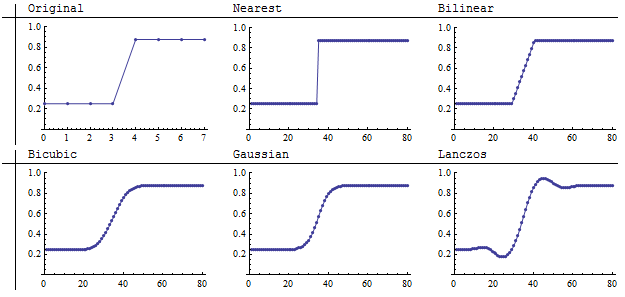
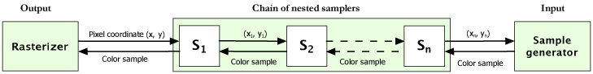

# Sampling and rasterization

## Sampling

Sampling is a very important concept within digital image processing and image analysis. It is a process where color samples are acquired given their logical coordinates in the (x, y) coordinate space.

A _sampler_ can be conceived as a scalar function f(x, y) that returns a color sample given a logical coordinate (x, y). A sample may be created synthetically (this is a common technique within ray-tracing, fractal rendering and pattern generation) but it may also be acquired from some static data source, such as a bitmap, or an input hardware device. Another very common method for acquiring samples is _resampling_.

In Graphics32 sampling is done by classes derived from the abstract base class [TCustomSampler](/api/GR32/TCustomSampler). This class provides the necessary mechanism for implementing different sampling techniques.

## Resampling

[Resampling](https://en.wikipedia.org/wiki/Image_scaling) is generally the process of reconstructing samples from a discrete input signal.
For example, in the illustration below we take an array of 8 input values, and from it we create an array of 80 output values, using different resampling methods:

The idea can also be extended from the 1D case to 2D. In the 2D case we can think of the bitmap as our signal. We have a number of pixels, aligned on a rectangular square grid. Hence we only know the actual color values at a number of discrete coordinates. In order to determine the color value of a sample at an arbitrary coordinate in a continuous image space, we need to perform interpolation for reconstructing this sample.

Descendants of the [TCustomResampler](/api/GR32/TCustomResampler) base class implement various algorithms for performing resampling and sample acquisition.
A general algorithm used for reconstructing samples is to perform convolution in a local neighborhood of the actual sample coordinate. This method is used in [TKernelResampler](/api/GR32_Resamplers/TKernelResampler), where a convolution filter is specified by the [TKernelSampler.Kernel](/api/GR32_Resamplers/TKernelSampler/Properties/Kernel) property.

Graphics32 includes a class called [TCustomKernel](/api/GR32_Resamplers/TCustomKernel) which is used as an ancestor class for various convolution kernels. For high quality resampling, one should consider using a kernel that approximates the ideal low-pass filter. The ideal low-pass filter is often referred to as a _sinc_ filter. It can be described by the formula

$sinc(x) = {sin(π x) \over π x}$
 

Since this function has infinite extent, it is not practical for using as a convolution kernel (because of the computational overhead). [TWindowedSincKernel](/api/GR32_Resamplers/TWindowedSincKernel) is a base class for kernels that use the _sinc_ function together with a _[window function](https://en.wikipedia.org/wiki/Window_function)_ (also known as _[tapering function](https://en.wikipedia.org/wiki/Tapering_\(mathematics\))_ or _[apodization function](https://en.wikipedia.org/wiki/Apodization)_). This way the kernel can be constrained to a certain width and reduce the amount of computations.

For further details about resampling, see the [Resamplers_Ex](/Examples#Resamplers%20Example) example project.

## Rasterization

By _rasterizing_ an image, we collect samples for each pixel of an output bitmap. The _rasterizer_ is responsible for the order in which output pixels are sampled and how the destination bitmap is updated. In Graphics32 rasterizers are classes derived from the [TRasterizer](/api/GR32_Rasterizers/TRasterizer) base class, overriding the protected _DoRasterize_ method.

Instances of `TRasterizer` need to be associated with a sampler and an output destination bitmap. Some rasterization schemes, such as _swizzling_ , may improve cache-performance for certain applications, since samples are collected in a local neighborhood rather than row by row. Rasterizers can also provide various transition effects for creating transitions between bitmaps.

Graphics32 includes the following rasterizers, among others:
| Class | Description |
| --- | --- |
| [TRegularRasterizer](/api/GR32_Rasterizers/TRegularRasterizer) | Rasterizes the bitmap row by row. |
| [TProgressiveRasterizer](/api/GR32_Rasterizers/TProgressiveRasterizer)| Rasterizes in a progressive manner by successively increasing the resolution of the image. |
| [TTesseralRasterizer](/api/GR32_Rasterizers/TTesseralRasterizer) | Rasterization by sub-division. |
| [TContourRasterizer](/api/GR32_Rasterizers/TContourRasterizer)| The rasterization path is determined from the intensity of the collected samples. |

## Nested sampling

If the input of one sampler is the output from another, then we have a _nested sampler_. Nested samplers are derived from the class [TNestedSampler](/api/GR32_Resamplers/TNestedSampler).

By nesting samplers, it is possible to create a chain of nested samplers between the sampler that generates the actual sample and the rasterizer. This mechanism is illustrated in the below image.

There are many different useful applications for nested samplers. A sampler can for example be associated with a transformation. This will transform the input coordinate that is passed to the sampler at the next level.

### Supersampling

It is possible to collect more than one sample in a local neighborhood of the pixel coordinate of the output pixel. This permits the use of techniques such as [_supersampling_](https://en.wikipedia.org/wiki/Supersampling), where several samples are collected in order to estimate the color of the area covered by a pixel in the destination bitmap. If supersampling is not performed, it may cause jagginess and aliasing artifacts in the output image. However, this also depends on what kind of reconstruction method is used and if samples are resampled.

### Kernel samplers

Another important class of nested samplers is _kernel samplers_. Kernel samplers compute an output sample from several subsamples in a local region of the input coordinate. Each subsample is combined with a kernel value (contained within a [TIntegerMap](/api/GR32_OrdinalMaps/TIntegerMap) object). A class-specific kernel operation is used to update a buffer for each collected sample. This permits a very simplistic implementation of convolution and morphological operations.

---

The following is a list of some of the different nested samplers that are included in Graphics32.

**Transformers**
* [TTransformer](/api/GR32_Resamplers/TTransformer) — transforms coordinates using an associated [TTransformation](/api/GR32_Transforms/TTransformation) object;
* [TNearestTransformer](/api/GR32_Resamplers/TNearestTransformer) — the same as above, but for nearest neighbor resampling.

**Super samplers**
* [TSuperSampler](/api/GR32_Resamplers/TSuperSampler) — performs regular supersampling;
* [TAdaptiveSuperSampler](/api/GR32_Resamplers/TAdaptiveSuperSampler) — performs adaptive supersampling;
* [TPatternSampler](/api/GR32_Resamplers/TPatternSampler) — performs sampling according to a predefined pattern.

**Kernel samplers**
* [TConvolver](/api/GR32_Resamplers/TConvolver) — performs convolution;
* [TSelectiveConvolver](/api/GR32_Resamplers/TSelectiveConvolver) — performs selective convolution;
* [TDilater](/api/GR32_Resamplers/TDilater) — performs morphological dilation;
* [TEroder](/api/GR32_Resamplers/TEroder) — performs morphological erosion;
* [TExpander](/api/GR32_Resamplers/TExpander) — special expansion operation;
* [TContracter](/api/GR32_Resamplers/TContracter) — special contraction operation.

For further details about nested sampling, see the [NestedSampling_Ex](/Examples#Nested%20Sampling%20Example) example project.
