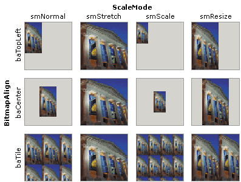

# Bitmap image

Internally a `TImage32` control represents the bitmap image with a [TBitmap32](/api/GR32/TBitmap32) object. This bitmap is surfaced by the [Bitmap](/api/GR32_Image/TCustomImage32/Properties/Bitmap) property. The scale and location of the bitmap within the control is determined by the following properties:

| Property | Description |
| --- | --- |
| [BitmapAlign](/api/GR32_Image/TCustomImage32/Properties/BitmapAlign) | Specifies if the bitmap image is positioned at the top-left corner of the control (`baTopLeft`), centered (`baCenter`), tiled (`baTile`) or it its exact location is determined by [OffsetHorz](/api/GR32_ImageTCustomImage32/Properties/OffsetHorz) and [OffsetVert](/api/GR32_ImageTCustomImage32/Properties/OffsetVert) properties. |
| [ScaleMode](/api/GR32_Image/TCustomImage32/Properties/ScaleMode) | Indicates if the bitmap image is displayed with its original size (`smNormal`), stretched to fit the control’s boundaries (`smStretch`), proportionally resized to fit the control’s boundaries(`smResize`) or proportionally scaled using its [Scale](/api/GR32_Image/TCustomImage32/Properties/Scale) property (`smScale`). |

The bitmap image is combined with the back-buffer according to its [DrawMode](/api/GR32/TCustomBitmap32/Properties/DrawMode) property. If its [DrawMode](/api/GR32TCustomBitmap32/Properties/DrawMode) is `dmCustom`, the bitmap will fire a series of [OnPixelCombine](/api/GR32_Image/TCustomImage32/Events/OnPixelCombine) events.
