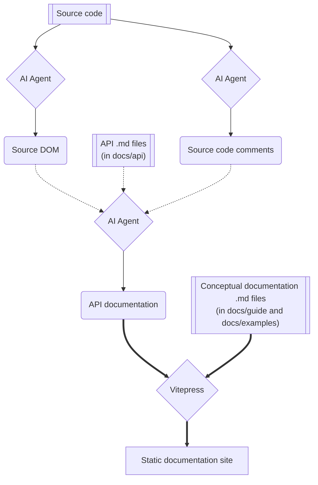

# Documentation Generation and Maintenance Guide

This document outlines the workflow, architecture, and commands for generating, building, and maintaining the Graphics32 documentation site using VitePress. It serves as a guide for both human maintainers and AI coding agents.

For detailed instructions on API documentation extraction, generic type naming rules, and unit tracking checklists, see [API Documentation Generation Guide](./how_to_generate_API_documentation.md).

---

## 1. Overview & Architecture

The Graphics32 documentation is built as a static site using [VitePress](https://vitepress.dev/).

### Repository Layout
```
/
├── package.json                   # Node package config with VitePress dependencies & scripts
├── docs/
│   ├── .vitepress/
│   │   ├── config.mts             # VitePress configuration (navigation, sidebars, theme)
│   │   ├── sidebar.ts             # Build-time sidebar generator with inherited member merging
│   │   ├── symbolMap.ts           # Markdown-it plugin for [[SymbolName]] short API links
│   │   ├── virtualMembers.ts      # Option B virtual member route generator
│   │   └── theme/
│   │       ├── index.ts           # Custom theme setup (@lando/vitepress-theme-default-plus, medium-zoom)
│   │       ├── custom.css         # CSS variables, hero gradient, and layout overrides
│   │       └── components/
│   │           └── ApiPage.vue    # Custom Vue Layout component for API reference pages
│   ├── index.md                   # Home / Landing page
│   ├── how_to_generate_documentation.md # This guide
│   ├── how_to_generate_API_documentation.md # Detailed API generation & tracking guide
│   ├── guide/                     # Conceptual guides, overview, topics, installation
│   │   └── images/                # Relative images for conceptual guides
│   ├── examples/                  # Code examples and tutorials
│   ├── public/                    # Favicon & public assets
│   │   ├── favicon.ico
│   │   ├── favicon.png
│   │   └── images/                # Embedded documentation images
│   └── api/                       # API reference documentation
│       └── <UnitName>/
│           ├── index.md           # Unit overview
│           └── <ClassName>/
│               ├── index.md       # Class overview
│               ├── Constructors/
│               │   └── <MethodName>.md # Grouped constructor overloads
│               ├── Methods/
│               │   └── <MethodName>.md # Grouped method overloads
│               ├── Properties/
│               │   └── <PropName>.md   # Property documentation
│               └── Events/
│                   └── <EventName>.md  # Event documentation
```

---

## 2. Prerequisites & Setup

- **Node.js**: Version 18.0.0 or higher (Node 22+ recommended)
- **npm**: Version 9.0.0 or higher

---

## 3. Initial Setup & Dependencies

To set up the documentation environment from scratch:

1. **Install Dependencies**:
   ```bash
   npm install
   ```

2. **Required Packages**:
   - `vitepress`
   - `@lando/vitepress-theme-default-plus`
   - `@nolebase/vitepress-plugin-enhanced-readabilities`
   - `mermaid`
   - `vitepress-plugin-mermaid`
   - `medium-zoom`
   - `markdown-it-mathjax3`
   - `swiper`

---

## 4. Running Local Development Server

To run the live preview server while editing documentation:

```bash
npm run docs:dev
```

This starts a hot-reloading dev server (typically at `http://localhost:5173`).

---

## 5. Building the Static Site

To generate production HTML/CSS/JS artifacts:

```bash
npm run docs:build
```

The output will be placed in `docs/.vitepress/dist`.

To preview the production build locally:

```bash
npm run docs:preview
```

---

## 6. Documentation Inheritance & Member Resolution

Graphics32 features large class hierarchies (e.g. `TCustomMap` -> `TCustomBitmap32` -> `TBitmap32`).

To eliminate documentation duplication and avoid creating hundreds of empty placeholder Markdown files:

1. **Ancestor Authoring**: Maintainers write member properties/methods **once** on the ancestor class where they are declared (e.g., `TCustomBitmap32/Properties/Width.md`).
2. **Inherited Sidebar Merger (`docs/.vitepress/sidebar.ts`)**: When building the sidebar for a derived class (`TBitmap32`), the sidebar generator traces the class's `inheritance` array in `index.md` and automatically merges inherited properties and methods into `TBitmap32`'s sidebar tree.
3. **Virtual Member Routes (`docs/.vitepress/virtualMembers.ts`)**: At build time, VitePress generates virtual member pages for derived classes (e.g., `/api/GR32/TBitmap32/Properties/Width`), pulling documentation metadata from `TCustomBitmap32.Width`.
4. **`ApiPage.vue` Inheritance Badge**: When `inheritedFrom` is present, `ApiPage.vue` displays an `Inherited from TCustomBitmap32.Width` badge and direct link.

---

## 7. Short Symbol References (`[[SymbolName]]`)

To reference API symbols cleanly without typing full relative paths:

- `[[TBitmap32.Draw]]` -> resolves to `/api/GR32/TBitmap32/Methods/Draw`
- `[[TBitmap32.Draw | Custom Label]]` -> renders as `Custom Label` pointing to `/api/GR32/TBitmap32/Methods/Draw`
- `[[GR32.TColor32]]` -> resolves to `/api/GR32/#tcolor32`

The `apiSymbolLinksPlugin` in `docs/.vitepress/symbolMap.ts` automatically scans `docs/api/` at build time and resolves references.

---

## 8. How API Documentation is Generated and Organized

See the [API Documentation Generation Guide](./how_to_generate_API_documentation.md) for full extraction rules, filename sanitization, and the unit tracking checklist.

### Custom Vue Layout Component (`docType: api`)

All API reference pages use `layout: doc` with `docType: api` in frontmatter, injecting `ApiPage.vue` into the `#doc-before` slot of `DefaultTheme.Layout`.

#### Why `docType: api`?
- **Enforces Fixed Structure**: Every API page shares identical header typography, unit badges, declaration blocks, inheritance trees, parameter tables, and sidebars.
- **Maintainer Freedom**: Human maintainers and AI agents write structured metadata in YAML frontmatter and focus on writing explanations, remarks, and code examples in Markdown below.

#### YAML Frontmatter Specification Example for API Pages:
```yaml
---
layout: doc
docType: api
unit: GR32
parent: TBitmap32
entity: TBitmap32.Draw
kind: Method # Class, Method, Property, Function, Record, Interface, Constant, Type
summary: "Draws a source bitmap or sub-rectangle onto this bitmap using current DrawMode and CombineMode."
overloads:
  - signature: "procedure Draw(DstX, DstY: Integer; Src: TCustomBitmap32); overload;"
    summary: "Draws the entire source bitmap at top-left pixel position (DstX, DstY)."
    parameters:
      - name: DstX, DstY
        type: Integer
        description: "Top-left destination coordinate on this bitmap."
      - name: Src
        type: TCustomBitmap32
        description: "Source bitmap to draw."
---
```

### Generation Workflow Diagram



---

## 9. Workflow for Updating Documentation

### A. Updating Conceptual Guides or Examples (Human Maintainers)
Human maintainers can directly edit or create `.md` files in `docs/guide/` or `docs/examples/`. Once committed, VitePress automatically includes them in the site build.

### B. Updating API Documentation when Pascal Source Code Changes
Follow the step-by-step procedures and progress checklist in [how_to_generate_API_documentation.md](./how_to_generate_API_documentation.md).

---

## 10. GitHub Actions Deployment & Staging Workflows

To prevent updating live documentation without human review, deployment to [https://github.com/graphics32/graphics32.github.io](https://github.com/graphics32/graphics32.github.io) should target a **`staging`** branch or staging preview environment.

### Strategy 1: Staging Branch Deployment (`publish_branch: staging`)

The following workflow builds the site on every push to `master`/`main` and deploys it to the `staging` branch of `graphics32.github.io`:

```yaml
name: Deploy Documentation to Staging

on:
  push:
    branches:
      - documentation
#      - master
#      - main

permissions:
  contents: write

jobs:
  deploy-docs-staging:
    runs-on: ubuntu-latest
    steps:
      - name: Checkout Source Repository
        uses: actions/checkout@v4

      - name: Setup Node.js
        uses: actions/setup-node@v4
        with:
          node-version: 22.x
          cache: 'npm'

      - name: Install Dependencies
        run: npm ci

      - name: Build VitePress Site
        run: npm run docs:build

      - name: Deploy to Staging Branch on graphics32.github.io
        uses: peaceiris/actions-gh-pages@v4
        with:
          personal_token: ${{ secrets.DOCS_DEPLOY_TOKEN }}
          external_repository: graphics32/graphics32.github.io
          publish_branch: staging
          publish_dir: docs/.vitepress/dist
          commit_message: "Automated staging build from graphics32 main repository"
```

---

## 11. Transitioning from Legacy Documentation Tools

- The legacy `DocProcessor/` tool and `Documentation/Source/` folder are preserved for reference during initial migration, but will be decommissioned once all content is transferred to VitePress.
- No external Pascal parsing executables or Windows-only CHM compilers are required to maintain or build this site.
